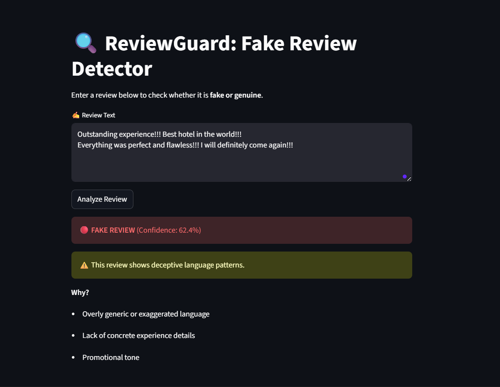
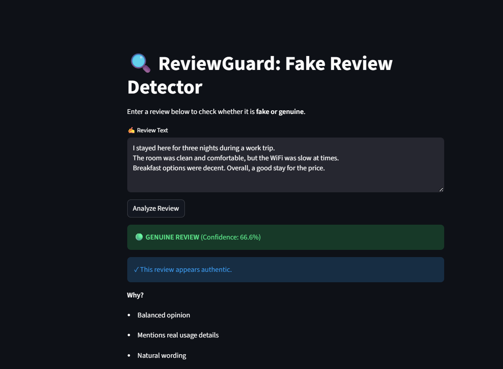
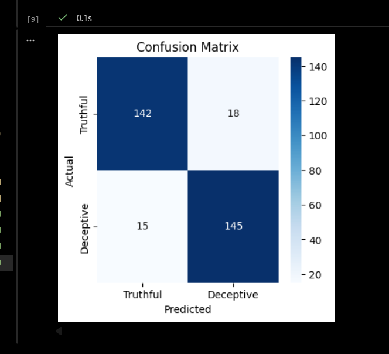

<div align="center">

# 🔍 ReviewGuard

### AI-Powered Fake Review Detection System

[](https://www.python.org/)
[](https://scikit-learn.org/)
[](https://streamlit.io/)

*Detecting deceptive online reviews using NLP & Machine Learning*

[Quick Start](#-quick-start) • [Methodology](#-methodology) • [Features](#-features) • [Results](#-results)

</div>

---

## 📖 Overview

**ReviewGuard** is a machine learning–based system designed to automatically detect **fake (deceptive) reviews** from online platforms. The project applies **Natural Language Processing (NLP)** techniques and classical machine learning models to classify reviews as *genuine* or *deceptive*.

This project was developed as an **academic final project** and demonstrates the complete ML pipeline — from data preprocessing and feature extraction to model training, evaluation, and deployment using a web interface.

> *"Not all reviews are honest — ReviewGuard helps separate truth from deception."*

---

## 🎯 Objectives

* Identify deceptive (fake) product reviews
* Apply NLP techniques for text preprocessing
* Use TF-IDF for feature extraction
* Train and compare baseline ML classifiers
* Deploy the trained model using a Streamlit web app

---

## ✨ Features

* ✅ Text preprocessing (cleaning, normalization)
* ✅ TF-IDF feature extraction
* ✅ Logistic Regression & Naive Bayes models
* ✅ Performance evaluation (accuracy, confusion matrix)
* ✅ Interactive Streamlit web application
* ✅ Clear project structure & reproducible pipeline

---

## 🧠 Methodology

### 1️⃣ Dataset

* Source: Deceptive opinion dataset
* Labels: `truthful` / `deceptive`
* Cleaned and standardized for modeling

### 2️⃣ Preprocessing

* Lowercasing
* Removal of punctuation & special characters
* Token normalization

### 3️⃣ Feature Extraction

* **TF-IDF (Term Frequency–Inverse Document Frequency)**
* Converts text into numerical vectors

### 4️⃣ Models Used

* Logistic Regression (primary model)
* Multinomial Naive Bayes (baseline comparison)

### 5️⃣ Evaluation

* Accuracy
* Precision, Recall, F1-score
* Confusion Matrix visualization

---

## 🚀 Quick Start

### 1️⃣ Clone Repository

```bash
git clone https://github.com/iman-tahir/ReviewGuard.git
cd ReviewGuard
```

### 2️⃣ Create Virtual Environment

```bash
python -m venv reviewGuard_env
source reviewGuard_env/bin/activate   # Linux/Mac
reviewGuard_env\Scripts\activate      # Windows
```

### 3️⃣ Install Dependencies

```bash
pip install -r requirements.txt
```

### 4️⃣ Run Streamlit App

```bash
streamlit run app/streamlit_app.py
```

---

## 🗂️ Project Structure

```
ReviewGuard/
│
├── app/
│   └── streamlit_app.py
│
├── data/
│   ├── raw/
│   └── processed/
│
├── models/
│   ├── review_model.pkl
│   └── vectorizer.pkl
│
├── notebooks/
│   ├── 01_EDA.ipynb
│   ├── 02_Preprocessing.ipynb
│   ├── 03_Model_Training.ipynb
│   ├── 04_Baseline_Models.ipynb
│   ├── 05_Evaluation.ipynb
│   └── Quick_Complete_Pipeline.ipynb
│
├── screenshots/
├── README.md
└── requirements.txt
```

---

## 📊 Results

### 📸 Screenshots

Below are sample screenshots demonstrating the working of the ReviewGuard application and evaluation results.

**Fake Review Detection**



**Genuine Review Detection**



**Confusion Matrix**



---

## 📊 Results

* **Accuracy:** ~87–88%
* Logistic Regression performed best overall
* Fake reviews show exaggerated & generic language
* Genuine reviews contain balanced opinions & real usage details

---

## 🖥️ Web Application

The Streamlit-based UI allows users to:

* Enter a review
* Get real-time prediction
* View confidence score
* Understand why a review is classified as fake or genuine

---

## 🔮 Future Work

* Use deep learning models (LSTM, BERT)
* Add multilingual support
* Improve explainability (SHAP / LIME)
* Deploy as a browser extension or API

---

## 👤 Author

<td align="center" width="33%">
<br />
<b>Eman Tahir</b><br />
<a href="https://github.com/RavenX-Iman">@RavenX-Iman</a><br />
</td>

---

## 📝 License

This project is developed **for academic purposes only**.

Free to use for learning and research with proper attribution.

---

<div align="center">

**[⬆ Back to Top](#-reviewguard)**

</div>
